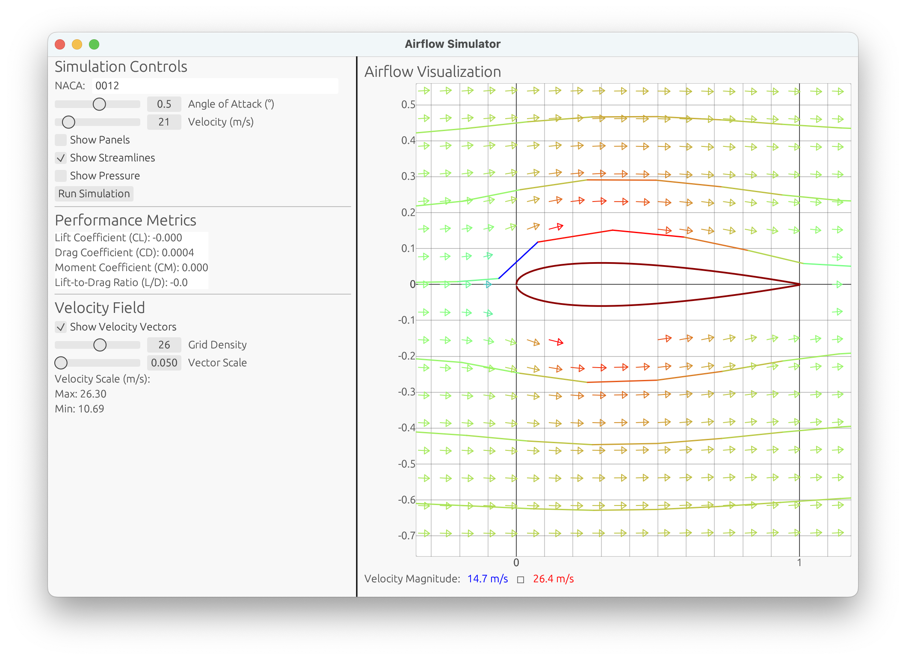
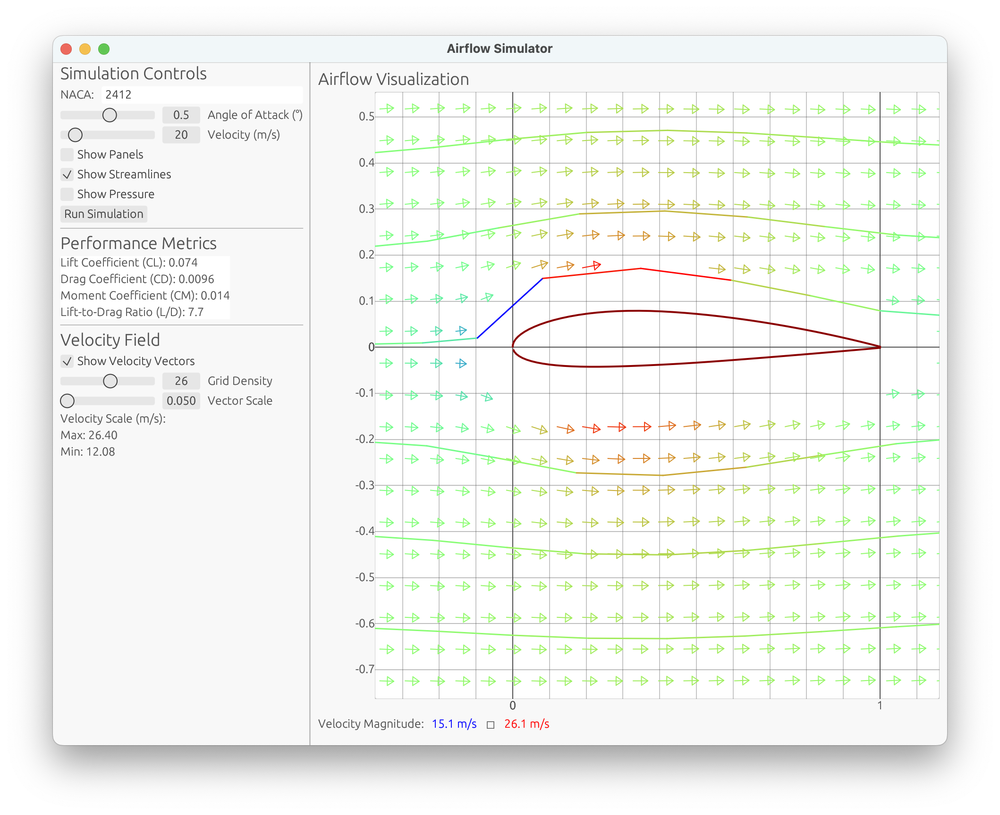

# Airflow Simulator: Panel Methods in Rust



This project implements **panel methods** for simulating 2D potential flow around airfoils, written in **Rust**. Panel methods are a popular numerical technique in aerodynamics, offering a way to compute flow fields, lift, and other aerodynamic properties for streamlined bodies.

Having primarily worked with Rust to build CLI and system-level tools, mainly for embedded devices; this project allows me to expand into scientific and graphical applications using Rust. The purpose of this project is to experiment with a relatively complex task that blends **mathematics**, **aerodynamics**, and **programming**.

> **Status**: This is a **Work in Progress (WIP)**.

---

## Features

### Completed
- **Airfoil Generation**:
    - Generates 2D airfoil shapes from NACA 4-digit series (e.g., `NACA 0012`).
    - Uses mean camber line and thickness distribution equations to build airfoil surfaces.

- **Panel Definition**:
    - Divides airfoil geometry into panels with control points and normal vectors.

- **Panel Method Solver**:
    - Implements a source-panel method for potential flow.
    - Solves a linear system of equations to compute panel strengths.
    - Includes freestream influence and angle of attack.

- **Pressure Distribution**:
    - Calculates pressure coefficients ($C_p$) along the airfoil surface.
    - Differentiates between upper and lower surfaces.

- **Performance Metrics**:
    - Computes aerodynamic coefficients:
        - **Lift Coefficient ($C_L$)**
        - **Drag Coefficient ($C_D$)** (from panel solutions, viscous effects not included)
        - **Moment Coefficient ($C_M$)** (about the quarter-chord).

- **Streamline Visualization**:
    - Calculates streamlines starting from specified points in the flow field.
    - Displays velocity variations along streamlines.
    - [4th order Runge-Kutta](https://lpsa.swarthmore.edu/NumInt/NumIntFourth.html) (RK4) numerical integration for solving streamlines and velocity fields.

- **Velocity Field Visualization**:
    - Generates a velocity field using a user-defined grid density.
    - Displays vectors scaled by velocity magnitude.

- **Graphical Interface**:
    - Built with `eframe`/`egui` for an interactive UI.
    - Includes adjustable sliders for parameters like:
        - Angle of attack.
        - Freestream velocity.
        - Grid density for velocity fields.
    - Interactive plots using `egui_plot`.

---

## Planned Adjustments and Features
1. **Improved Solver**:
    - Extend panel method to include **vortex panels** for handling lifting flows more accurately.
    - Account for leading-edge and trailing-edge flow features.

2. **Boundary Conditions**:
    - Improve influence coefficient calculations for higher precision.

3. **Viscous Effects**:
    - Implement an approximation for boundary layer and drag due to viscosity.

4. **3D Extension**:
    - Experiment with lifting-line theory or a 3D panel method for finite wings.

5. **Interactive Airfoil Design**:
    - Allow users to define custom airfoil shapes or load geometry from files.

6. **Performance Visualization**:
    - Add visual comparisons of lift and drag for different airfoils and flow conditions.

7. **Optimized Numerical Methods**:
    - Use parallel computing for large grids or higher panel resolutions.

8. **Validation**:
    - Compare results with CFD software or analytical solutions for benchmark cases.

---

## How to Run
1. Clone the repository:
   ```bash
   git clone https://github.com/boulama/flowvisualizer.rs
   cd flowvisualizer.rs
   ```

2. Build and run the application:
   ```bash
   cargo run --release
   ```

3. Use the interactive GUI to:
    - Input a **NACA code** (e.g., `0012`) to generate an airfoil.
    - Adjust flow conditions, such as angle of attack and velocity.
    - Visualize results like streamlines, pressure distribution, and velocity fields.

---

## Dependencies
- **`eframe` and `egui`**: For GUI and plotting.
- **`nalgebra`**: For vector and matrix operations.
- **`egui_plot`**: For creating interactive plots.
- **`std::f64::consts`**: For constants like $\pi$.

---

## Screenshots

---

## Contributing
This project is open for contributions! If you have ideas for enhancements or want to tackle a specific feature, feel free to fork the repository and submit a pull request.

---

## Acknowledgments
- [NACA equations](https://web.stanford.edu/~cantwell/AA200_Course_Material/The%20NACA%20airfoil%20series.pdf)
- [VI. The Panel Method: An Introduction](https://open.oregonstate.education/intermediate-fluid-mechanics/chapter/the-panel-method-an-introduction/#:~:text=The%20panel%20method%20is%20basically,the%20surface%20of%20the%20object)
- Inspiration for panel methods from classic the classic *[Fundamentals of Aerodynamics](https://www.mheducation.com/highered/product/Fundamentals-of-Aerodynamics-Anderson.html)* by John D. Anderson.

---

### License
This project is licensed under [GLWTPL](./LICENSE). See [LICENSE](./LICENSE) for details.